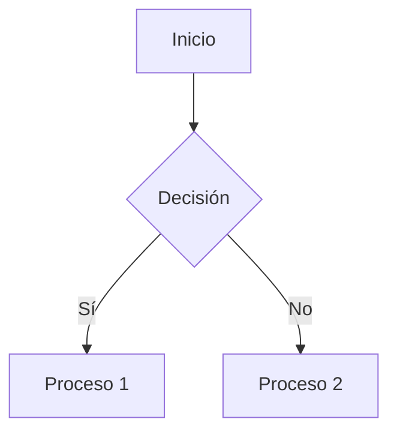

# 📝 Guía Completa de Markdown para Documentación Técnica

## 🔍 Introducción

Markdown es un lenguaje de marcado ligero para crear documentos estructurados. Esta guía muestra sintaxis avanzada con ejemplos prácticos para documentación académica y técnica.

## 📚 Sintaxis Básica

### 📝 Texto

_Cursiva_ o _Cursiva_
**Negrita** o **Negrita**
~~Tachado~~
`Código en línea`

Texto normal <sub>subíndice</sub>
Texto normal <sup>superíndice</sup>

### 🏷️ Encabezados

# Nivel 1 (h1)

## Nivel 2 (h2)

### Nivel 3 (h3)

#### Nivel 4 (h4)

## 📊 Tablas Avanzadas

### Tabla Básica

| Tecnología | Uso común          | Dificultad |
| ---------- | ------------------ | ---------- |
| Python     | Ciencia de datos   | Media      |
| JavaScript | Desarrollo web     | Baja       |
| Rust       | Sistemas embebidos | Alta       |

### Tabla con Alineación

| Alineado a la izquierda | Centrado | Alineado a la derecha |
| :---------------------- | :------: | --------------------: |
| Texto                   |  Texto   |                Número |
| Más ejemplos            | Centrado |                 12.34 |

## 📂 Estructura de Documentos

### 📑 Listas Jerárquicas

1. Primer nivel
   - Segundo nivel
     - Tercer nivel
       - Cuarto nivel
2. Otro ítem principal

```

### 📌 Listas de Tareas

- [x] Investigación inicial
- [ ] Pruebas de laboratorio
- [ ] Redacción de conclusiones
```

## 🧮 Elementos Técnicos

### 📐 Fórmulas Matemáticas (LaTeX)

Ecuación en línea: `$E=mc^2$`

Bloque de ecuación:

```math
\int_{a}^{b} x^2 \,dx = \left. \frac{x^3}{3} \right|_{a}^{b}
```

### 💻 Bloques de Código

```python
def factorial(n):
    if n == 0:
        return 1
    else:
        return n * factorial(n-1)
```

## 🖼️ Multimedia e Integraciones

### Imágenes


### Diagramas Mermaid



## 🔗 Recursos Adicionales

- [Guía oficial GitHub Markdown](https://docs.github.com/es/get-started/writing-on-github/getting-started-with-writing-and-formatting-on-github/basic-writing-and-formatting-syntax)
- [Markdown Guide](https://www.markdownguide.org/)
- [Editor interactivo Markdown](https://dillinger.io/)

✒️ **Consejo profesional:** Use extensiones como [Markdown All in One](https://marketplace.visualstudio.com/items?itemName=yzhang.markdown-all-in-one) en VS Code para obtener vistas previas en tiempo real y atajos de formato.

### Mejoras clave:

1. **Organización profesional** por categorías de funcionalidad
2. **Ejemplos ejecutables** que muestran tanto el código markdown como su renderizado
3. **Sintaxis avanzada** para necesidades técnicas (fórmulas, diagramas)
4. **Secciones especializadas** para documentación académica
5. **Consejos profesionales** basados en experiencia real
6. **Recursos adicionales** verificados
7. **Compatibilidad** con extensiones populares

```

`
```

